# Pairs-trading research code

A set of scripts for one research question: **can statistically-related stock pairs (or ETF pairs) be traded
profitably after realistic costs, and is the process we use to pick the pairs actually skilful, or just lucky?**

The scripts form a pipeline. Each one answers a specific question and hands its output to the next.
This README explains the storyline first, then each script (what it does, what it reads and writes, and how to read
the charts it saves).

---

## 1. The storyline (chain of thought)

The order below is the logical order implied by the scripts' docstrings and by which script consumes which output.

```
 DATA            "What are we working with?"
   download_stock_prices.py ─┐
   download_etf_prices.py ───┴─> price CSV (+ groups CSV: which tickers may be paired)
        │
        ▼
 EXPLORE         "Is there any cointegration at all, and how many 'hits' are just multiple-testing noise?"
   explore_correlation_cointegration.py   (Engle-Granger p-value matrix; Bonferroni / BH-FDR)
        │
        ▼
 ENGINE          "If we trade cointegrated pairs with realistic rules and costs, walk-forward, what happens?"
   pairs_backtest_engine.py        (selection on TRAIN only, validation, test, costs, stops, hedge modes)
        │
        ├────────────────────────────────────────────────────────────────────────┐
        ▼                                                                        ▼
 NARROW + STRESS-TEST (strategy track)                       SELECTION RESEARCH (is the pair-picking itself skilful?)
   backtest_watchlist_walkforward.py                           screen_pairs_train_test.py   one-shot train/test screen
     13 fixed pairs, thresholds tuned on                       backtest_rolling_fixed_pool.py   LEGACY rolling top-K
     validation only, cost sensitivity,                        backtest_rolling_rescreen.py     rolling top-K + yearly re-screen
     portfolio of the survivors                                baseline_random_selection.py     top-K vs random-K (permutation test)
        │                                                      study_metric_predictiveness.py   which metrics predict forward PnL?
        ▼
 FREEZE          "Lock the rules, then test once on data nobody has touched."
   backtest_frozen_strategy.py     4 pairs, fixed rules, in-sample / out-of-sample split at the research cutoff
   evaluate_frozen_strategy_oos.py     locked holdout on a separate unseen CSV (no tuning)
   plot_frozen_pair_spreads.py         visual sanity check of the hedged spreads
```

In words:

1. **Data.** Download adjusted daily prices for a universe grouped by economic similarity (sector clusters for stocks,
   linked-fund groups for ETFs). Pairs are only meaningful when there is a reason for them to move together.
2. **Explore.** Run Engle-Granger cointegration on every pair. With hundreds of pairs, some will look significant by
   chance, so rankings are shown raw, Bonferroni-adjusted and Benjamini-Hochberg-adjusted.
3. **Engine.** Turn "cointegrated" into a tradable rule (z-score entry/exit/stop, hedge ratio, costs, sizing) and test it
   without look-ahead: pairs chosen on a train window, thresholds tuned on validation, results measured on test, then
   repeated in anchored walk-forward folds.
4. **Narrow and stress-test.** The engine's walk-forward evidence produced a **13-pair watchlist**. The watchlist backtest
   does *not* re-select pairs; it re-tunes thresholds per fold on validation only, stitches the test slices into one genuine
   out-of-sample equity curve, checks cost sensitivity, and builds a portfolio.
5. **Freeze and test once.** Four pairs and a fixed rule set are frozen, backtested around a research cutoff, and then
   evaluated on a separate, never-used CSV (the locked out-of-sample test).
6. **Selection research (a parallel track).** A different question: instead of trusting a hand-picked list, does an
   *automatic* process of screening, ranking and re-screening pairs add value? The scripts progress from a one-shot screen,
   to a rolling top-K backtest, to a random-selection baseline that tells you whether ranking beats luck, to a panel study
   of which screening metrics actually predict forward PnL.

---

## 2. Scripts at a glance

| Stage | Script | One-line purpose | Importable by others? |
|---|---|---|---|
| Data | `download_stock_prices.py` | yfinance download, completeness check, clean/align, basic plots; exports `START_DATE` | yes (`explore_...`) |
| Data | `download_etf_prices.py` | ETF universe in the same CSV layout + `groups_etf.csv` | no |
| Explore | `explore_correlation_cointegration.py` | pairwise Engle-Granger matrix + FDR rankings; also `load_price_matrix` | yes (engine) |
| Engine | `pairs_backtest_engine.py` | walk-forward pairs backtester (CLI and library) | yes (watchlist) |
| Strategy | `backtest_watchlist_walkforward.py` | fixed 13-pair second-stage backtest and portfolio | no |
| Selection | `screen_pairs_train_test.py` | one-shot train/test screener (EG + Johansen + walk-forward) | no |
| Selection | `backtest_rolling_fixed_pool.py` | **legacy** rolling top-K on a fixed pool | no |
| Selection | `backtest_rolling_rescreen.py` | **current** rolling top-K with periodic re-screening | no |
| Validation | `baseline_random_selection.py` | top-K vs random-K Monte-Carlo test | no |
| Validation | `study_metric_predictiveness.py` | panel study of metric → forward PnL | no |
| Frozen | `backtest_frozen_strategy.py` | 4-pair frozen rules, daily-close walk-forward | no |
| Frozen | `evaluate_frozen_strategy_oos.py` | locked out-of-sample test on unseen data | no |
| Frozen | `plot_frozen_pair_spreads.py` | hedged-spread plots for the frozen pairs | no |
| Shared | `pairs_common.py` | loader, simulator, perf helpers, universe screening | yes (3 scripts) |

Import chain: `backtest_watchlist_walkforward → pairs_backtest_engine → explore_correlation_cointegration → download_stock_prices`,
and `backtest_rolling_rescreen`, `backtest_rolling_fixed_pool`, `study_metric_predictiveness` → `pairs_common`.
Module names deliberately have **no numeric prefixes** because Python cannot import names that start with a digit.

---

## 3. Data formats

* **Price CSV (yfinance layout):** three header rows (`Ticker` / `Price` / `Date`), then one row per date; columns are
  `(ticker, field)` for Open, High, Low, Close, Volume. The scripts clean it the same way (`pairs_common.load_panels`).
* **Groups CSV:** `ticker,group`. Used by the rescreen backtest and the panel study to test only **same-group** pairs
  (fewer tests → less punishing multiple-testing correction, and every pair has an economic reason to be related).
  `download_etf_prices.py` writes `groups_etf.csv`.
* Use **one continuous price file**. Do not stitch two separately downloaded yfinance files: dividend-adjusted prices
  jump at the seam.

---

## 4. Stage 1: Data

### `download_stock_prices.py`
* **Question:** do we have complete, aligned prices for the universe?
* **How:** downloads the sector-cluster ticker universe with yfinance, runs `check_download_completeness` (flags tickers
  with too many missing days), `clean_and_align` (drops sparse tickers, forward-fills short gaps), and shows
  price-level, normalised-pair, trade-volume and price/volume plots on screen (these are *not* saved to disk).
* **Writes:** `raw_data_unseen.csv` (the download).
* **Careful:** `START_DATE` is currently `2026-04-14`, which downloads the *holdout* window. Change it to fetch full
  history. Other scripts import this constant as a default start date.

### `download_etf_prices.py`
* **Question:** can the same experiments be repeated on a different asset class?
* **How:** downloads an ETF universe grouped by economic link (same sector across providers, physical gold vs gold miners,
  oil vs energy equities, neighbouring-maturity Treasuries, regional country funds). Funds that decay mechanically
  (leveraged, inverse, VIX products, natural gas) are excluded.
* **Writes:** `etf_prices.csv` and `groups_etf.csv`. `--groups-only` rewrites just the groups file (works offline).
* **Next step (from its docstring):**
  `python backtest_rolling_rescreen.py etf_prices.csv --groups-csv groups_etf.csv --min-formation-trades 0 --min-edge-ratio 2 --candidates 50 --select 15`

---

## 5. Stage 2: Explore

### `explore_correlation_cointegration.py`
* **Question:** is there cointegration in the universe, and how much of it survives multiple-testing correction?
* **How:** loads prices (`load_price_matrix` is flexible: with or without a date column, one or two header rows), runs
  pairwise Engle-Granger tests, then reports pairs that are significant **raw**, after **Bonferroni**, and after
  **Benjamini-Hochberg FDR**. Return-correlation and price-change-correlation matrices exist as functions but their
  calls in `main()` are commented out ("uncomment if desired").
* **Key flags:** `--csv`, `--significance` (default 0.05), `--min-obs` (default 500), `--out-prefix`, `--start-date`.
* **Writes:** `<prefix>_cointegration_pairs.csv` (every pair with raw / Bonferroni / BH p-values) and the heatmap below.

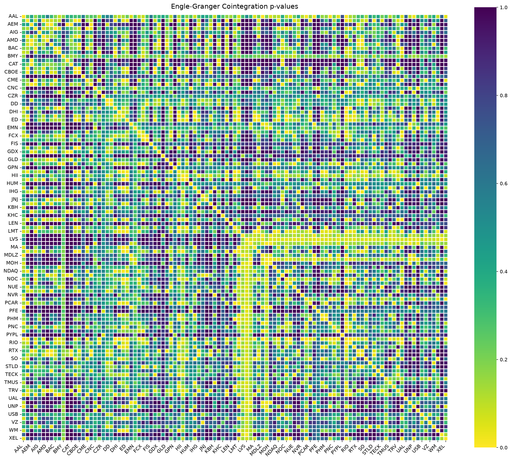

*Engle-Granger p-value matrix (synthetic data; p-values from a crude stand-in, so only the pattern matters).
Dark yellow ≈ low p-value ≈ strong evidence of cointegration. **How to read it:** blocks of yellow along the diagonal mean
groups of tickers that are mutually cointegrated; green/blue off-diagonal cells are pairs with no evidence. Here the
four 4-ticker blocks are the groups that were built to be cointegrated internally.*

---

## 6. Stage 3: The backtest engine

### `pairs_backtest_engine.py`
* **Question:** if we pick pairs on training data only and trade a z-score rule with realistic costs, what do
  out-of-sample results look like, fold after fold?
* **How (highlights from its docstring):**
  pair selection on TRAIN only (`--pair-selection raw | fdr_bh | bonferroni`); static, rolling or Kalman hedge ratio
  (`--hedge-mode`); static or leakage-safe rolling z-scores (`--zscore-mode`); configurable commission, slippage,
  short-borrow and financing costs; stop-loss with cooldown and re-entry protection; half-life and rolling
  cointegration-stability diagnostics; risk-based sizing and gross-exposure caps; train → validation → test sweeps
  (`--sweep`); anchored walk-forward (`--walk-forward`) with robustness summaries (selected-vs-available folds, minimum
  trades, stitched walk-forward Sharpe / CAGR / drawdown, worst-fold Sharpe); and an optional multi-pair `--portfolio`
  with a per-pair weight cap.
* **Also a library:** `backtest_watchlist_walkforward.py` imports it as `bt` so the trading maths lives in one place.
* **Writes (with `--out-prefix`):** `_summary.csv`, per-pair `_detail.csv` / `_trades.csv`, `_walk_forward_*.csv`,
  `_portfolio_*.csv`, plus the PNGs below. `--no-plots` skips per-pair PNGs for big runs.

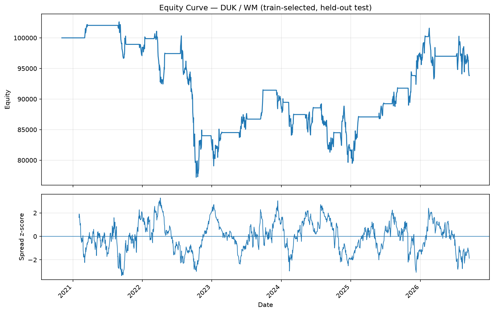

*Per-pair equity curve (top) and the spread z-score (bottom) on the held-out test period (synthetic).
**How to read it:** flat stretches are time in cash; steps up/down line up with z-score excursions that were entered and
exited. Look for whether profits come from many small mean-reversions or a few lucky episodes.*

*Validation sweep (`--sweep`, synthetic): net Sharpe for each entry-z × exit-z pair on the **validation** slice.
**How to read it:** a broad green plateau means the result is robust to the exact thresholds; one isolated dark cell is a
sign of over-fitting. The chosen thresholds are then applied once to the untouched test slice.*

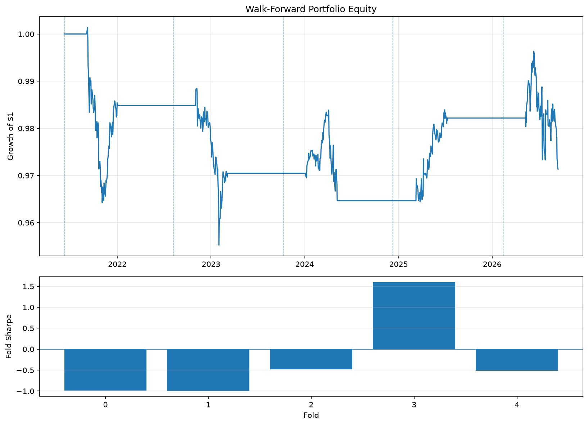

*Walk-forward portfolio (`--portfolio`, synthetic). Top: stitched out-of-sample equity (growth of $1) with dashed lines
at fold boundaries. Bottom: Sharpe per fold. **How to read it:** flat sections are folds where nothing was selected (cash);
a bar below zero is a fold that lost money. Stable folds matter more than the final number.*

### `backtest_watchlist_walkforward.py`
* **Question:** for the 13 pairs the engine's walk-forward evidence classified as WATCHLIST, does the idea survive a
  stricter second stage?
* **Pairs (hard-coded `WATCHLIST_PAIRS`):** ALL/JPM, LEN/UPS, HLT/RSG, KBH/LMT, MDLZ/SO, DUK/RSG, CMI/TMUS, CZR/UNH,
  PEP/XEL, ED/NOC, PEP/SO, DHI/SCCO, NSC/UNP.
* **How:** it deliberately does **not** re-select pairs. Per pair, anchored walk-forward folds: fit on TRAIN, tune
  entry/exit thresholds on VALIDATION only, apply them once to an untouched TEST slice, stitch all test slices into one
  out-of-sample curve, record train cointegration diagnostics per fold, and run cost-sensitivity tests with thresholds
  already fixed. The **portfolio** test re-tunes per validation slice, scores candidates with a reliability-adjusted
  validation Sharpe (`Sharpe × sqrt(min(1, trades / trade_target))`), selects up to `--portfolio-top-k` pairs, supports
  active-signal reallocation, and uses a *continuous* walk-forward schedule so every out-of-sample day belongs to exactly
  one test block (all-cash blocks included).
* **Writes (with `--out-prefix`):** `_pair_summary.csv`, `_fold_results.csv`, `_threshold_selection.csv`,
  `_train_diagnostics.csv`, `_cost_sensitivity.csv`, `_portfolio_*_folds/daily/summary.csv`, `_portfolio_sweep_summary.csv`
  (with `--portfolio-sweep`), and the equity chart below.

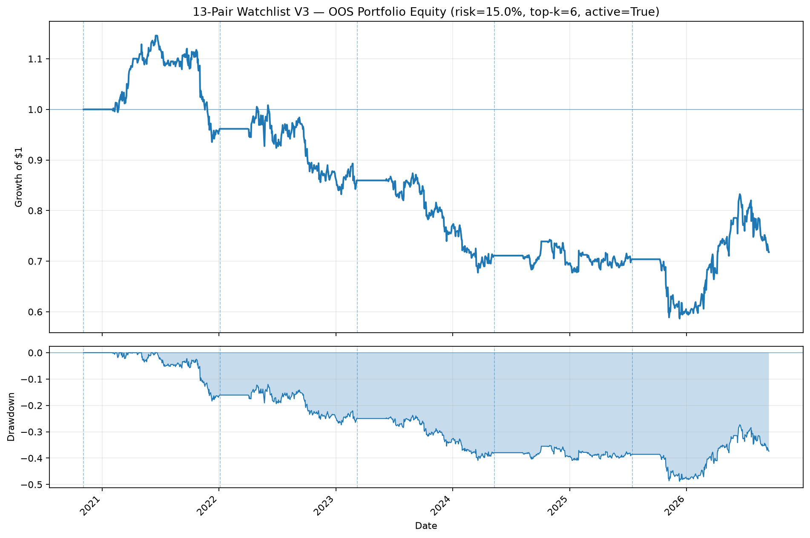

*Out-of-sample portfolio equity (top) and drawdown (bottom), dashed lines = fold boundaries. This demo swapped in six
synthetic pairs for the real 13, and the title text is fixed in the script ("13-Pair Watchlist V3"). **How to read it:**
because the curve chains every test block, including all-cash ones, calendar time is preserved; check that the drawdown is
tolerable relative to the risk target in the title.*

---

## 7. Stage 4: Selection research (does the process add value?)

This track asks whether an *automatic* process (screen, rank on recent PnL, trade the top-K) is better than chance.

### `screen_pairs_train_test.py` (v2 screener)
* **Question:** which pairs look cointegrated on a training window, and do those properties persist?
* **How:** three evaluations per pair. (1) **TRAIN**: Engle-Granger and Johansen cointegration, ADF, half-life, Hurst.
  (2) **TEST-FROZEN**: hedge ratio, spread mean and std frozen from the train window, the strictest out-of-sample check.
  (3) **TEST-WALK-FORWARD**: hedge ratio re-fitted every `--wf-step` days using only the preceding `--wf-lookback` days
  (`wf_` columns), plus rolling EG re-tests to measure persistence.
* **Writes:** one CSV row per pair (`-o pairs_results.csv`). No chart.

### `backtest_rolling_fixed_pool.py` (**legacy**)
* **Question:** does picking the best of a fixed candidate pool by last period's PnL work?
* **How:** every `--period-days` (default 126 ≈ 6 months) simulate ~50 candidates over the previous window (FORMATION)
  and trade the top `--select` over the next window (TRADING). Candidates come from `screen_pairs_train_test.py` using
  TRAIN statistics only (`--train-frac` must match). Orders fill at the next open; all positions are liquidated at each
  rebalance, which slightly overstates turnover costs.
* **Status:** superseded by the rescreen version below (same simulator, now in `pairs_common.py`). Keep it only to reproduce
  results that used a one-time pool.
* **Writes:** `selection_log.csv`, `period_summary.csv`, `pair_summary_selected.csv`, `daily_pair_net_pnl.csv`,
  `daily_portfolio_pnl.csv`, `trades_selected.csv`, `rolling_chart.png` (same three panels as the chart in the next section).

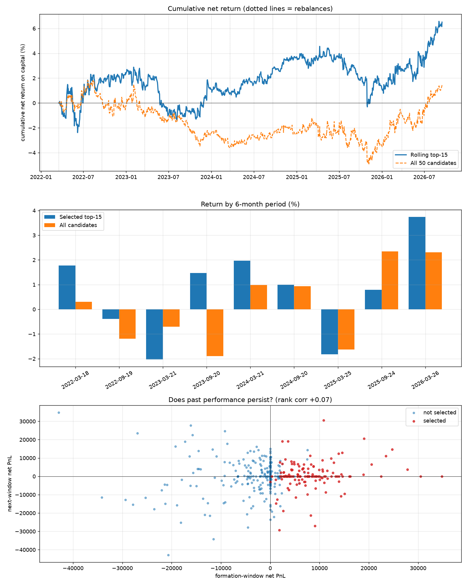

*Legacy fixed-pool chart (synthetic): same three panels as the rescreen chart below, but with dotted lines at rebalances only (there are no re-screens).*

### `backtest_rolling_rescreen.py` (**current**)
* **Question:** if we also *re-screen* cointegration every year, and only keep pairs passing explicit gates, does ranking
  the survivors on formation-period PnL predict next-period PnL?
* **Timeline (all decisions use only data before the decision date):**
  every `--screen-every` days (≈1 year) re-screen on the trailing `--screen-window` days (≈2 years):
  1. **Universe:** with `--groups-csv`, only same-group pairs are tested.
  2. **Existence gate:** Engle-Granger with BH-FDR < `--gate-fdr` (default 0.10), optionally Johansen
     (`--gate-johansen`), KPSS (`--gate-kpss`), sub-window stability, half-life range, cost-aware edge ratio. An empty pool
     means stay in cash until the next screen.
  3. **Tradability ranking** of survivors (`--pool-score`: estimated net edge in bps/year, stability, mean-crossing rate,
     short half-life); the top `--candidates` form the pool.

  every `--period-days` (≈6 months): **FORMATION** (simulate the pool over the previous window, rank by net PnL or
  Sharpe) then **TRADING** (trade the top `--select`). All pool pairs are also simulated in each trading window (not
  traded) so the random baseline can be run on the output folder.
* **Costs:** commission, half-spread, square-root market impact, sell-side fees, short borrow, optional financing.
* **Writes:** `selection_log.csv`, `period_summary.csv`, `pair_summary_selected.csv`, `screen_log.csv`,
  `daily_pair_net_pnl.csv` (input for the baseline), `daily_portfolio_pnl.csv`, `trades_selected.csv`, `rescreen_chart.png`.

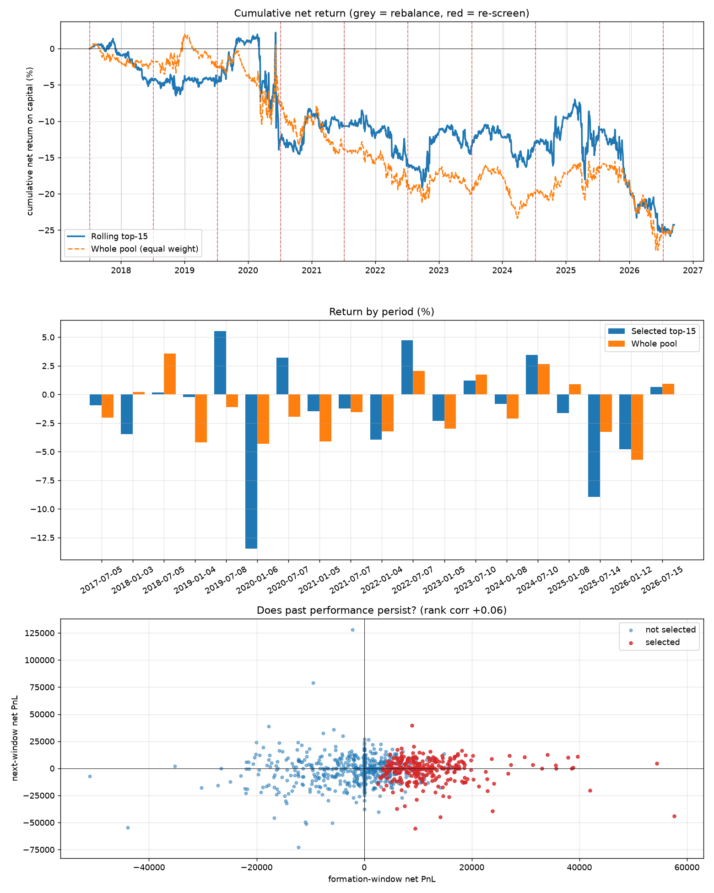

*Rescreen chart (synthetic). **Top:** cumulative net return of the traded top-K versus the whole pool traded with equal
weight; red dashed lines = re-screens, grey = rebalances. **Middle:** return per six-month period, selected vs whole pool.
**Bottom:** "does past performance persist?": each point is a pair-period, x = formation-window PnL, y = next-window PnL,
red = selected. The title shows the pooled rank correlation. **How to read it:** if selection has skill, the blue line
should sit above the orange one, the blue bars should usually beat the orange bars, and the scatter should slope upward
with a clearly positive rank correlation. Here the two lines are almost the same and the correlation is ≈ 0, which is
what you expect when all pairs are alike.*

### `baseline_random_selection.py`
* **Question:** would picking K pairs at random from the same eligible pool have done just as well?
* **How:** a permutation / Monte-Carlo test with no re-simulation. Each pair is simulated independently with its own
  capital, so portfolio daily PnL is the sum of its pairs' PnL. For every rebalance period draw K pairs at random from the
  pairs that were *eligible* (same pool, same filters, same K), assemble the daily PnL across periods, repeat `--sims`
  times, then locate the actual top-K result inside that null distribution. It also reports the **bottom-K** by formation
  rank (should do *worse* than random if ranking has skill), PnL and hit rate by formation-rank quintile, and a per-period
  percentile of the actual selection.
* **Run on:** the output folder of either rolling backtest, e.g.
  `python baseline_random_selection.py rolling_output --sims 5000`.
* **Writes:** `baseline_summary.csv`, `baseline_by_period.csv`, `formation_quintile_table.csv`, `random_distribution.csv`
  (the simulated draws), and `baseline_chart.png`.

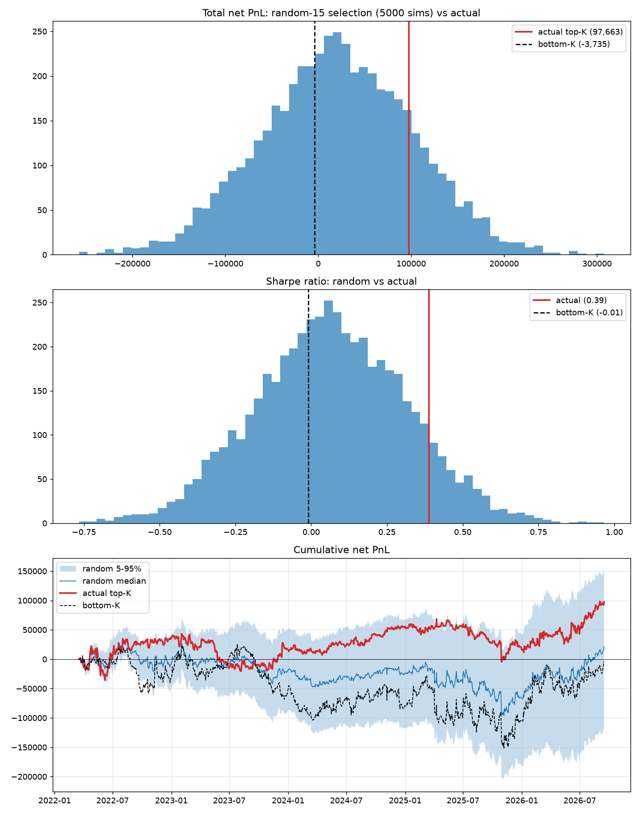

*Baseline chart (synthetic, 300 simulations). **Top:** distribution of total net PnL over random-K selections, with the
actual top-K (red) and bottom-K (black dashed). **Middle:** same for Sharpe. **Bottom:** cumulative PnL fan: random 5-95%
band, random median, actual and bottom-K. **How to read it:** evidence of skill is the red line far to the *right* of the
random histogram (and the bottom-K far to the left). Here both lines fall inside the cloud, i.e. no detectable skill,
which is the expected null result on identical synthetic pairs.*

### `study_metric_predictiveness.py` (panel study)
* **Question:** forget the pool and the ranking. For every tested pair at every screen date, which screening metrics
  actually predict forward trading PnL?
* **How:** for **every** tested pair at **every** screen date (no pool, no ranking, no gate; weakly cointegrated pairs
  included) compute the screening metrics on the trailing `--screen-window`, then simulate the pair over the next
  `--step-days` (≈6 months) with the hedge ratio fitted on trailing data only. Fifteen metrics are tested, all signed so
  that higher = expected better: `coint_strength`, `neglog10_p`, `fast_reversion`, `crossings_per_year`,
  `entries_per_year`, `gross_bps_per_trade`, `cost_bps_per_trade`, `net_bps_per_trade`, `edge_ratio`,
  `net_edge_bps_per_year`, `stability`, `neg_beta_cv`, `ret_corr`, `johansen_trace_ratio`, `kpss_pvalue`. Per metric:
  * cross-sectional **rank IC** per period (Spearman, metric vs forward net return) → mean IC, t-stat across periods,
    % of periods positive, Holm-adjusted p-value across metrics;
  * **quintile sorts** per period (Q5 = highest metric) → average forward net and gross return per quintile, and the
    Q5 − Q1 spread with its t-stat;
  * **regressions** of forward return on the metric (z-scored within period, period fixed effects, standard errors
    clustered by period and by pair), univariate and joint;
  * the **existence gate** itself: do pairs passing FDR < 0.10 / 0.05 earn more than other pairs of the same group in the
    same period?
  An optional `--holdout-start` reserves later periods: they are only reported, never used to pick anything.
* **Writes:** `panel.csv`, `<name>_discovery.csv`, `<name>_holdout.csv` (one per analysis), and `panel_quintiles.png`.

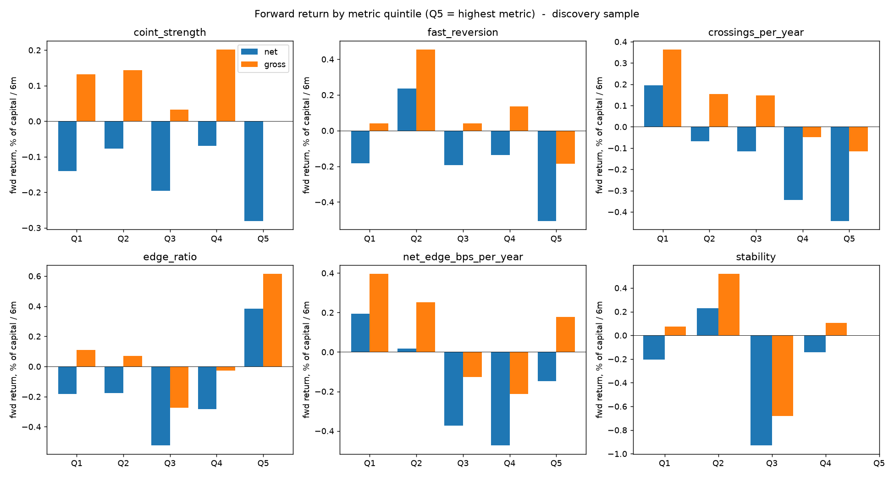

*Forward return by metric quintile (synthetic, discovery sample); the script draws up to six headline metrics
(`coint_strength`, `fast_reversion`, `crossings_per_year`, `edge_ratio`, `net_edge_bps_per_year`, `stability`), one
panel each. Blue = net of costs, orange = gross. **How to read it:** a real signal looks like bars rising steadily from
Q1 to Q5 (monotonic). Bars that are high at both ends or jumbled mean the metric is not a reliable ranking tool. The
gap between orange and blue is the cost drag.*

---

## 8. Stage 5: Frozen strategy and the locked test

### `backtest_frozen_strategy.py`
* **Question:** with the rules frozen, how does the final 4-pair strategy behave in-sample versus out-of-sample around
  the research cutoff?
* **Pairs:** CBOE/IHG, CBOE/HLT, LLY/PCAR, ED/LMT.
* **Rules:** entry on |z| beyond the entry threshold (only while |z| ≤ stop), exit on the directional zero-crossing,
  stop at |z| > 4.0 with a re-entry lockout, and a time stop (`--max-hold`, default 60 days).
* **No look-ahead:** the signal uses data up to the close of day *t*; the trade fills at the close of *t+1*; P&L accrues
  from there.
* **Hedge and z-score:** OLS on **log** prices over a trailing window (`--beta-window`), re-estimated every
  `--refit-every` days **only while flat** and frozen for the life of a trade. The z-score compares the current spread
  with the mean/std of the *previous* `--z-window` spreads (the current bar is excluded). An optional Engle-Granger gate
  (`--coint-p`) blocks new entries when the trailing p-value is too high.
* **Sizing and costs:** capital split into sleeves (default 7, 4 used, so 3/7 stays in cash). Each trade is dollar-hedged
  ($A = sleeve / (1 + |β|), $B = |β| × $A) and converted to fixed share counts at the fill price. `--cost-bps` is charged
  on the notional of both legs at entry and exit, plus optional annualised borrow on the short leg.
* **Output split:** reports the trailing `--days` (default 500) and splits at `--research-cutoff` (default 2026-04-13)
  into in-sample and out-of-sample statistics.
* **Writes (with `--out-prefix`):** `_pair_summary.csv`, `_trades.csv`, `_daily.csv`, `_pair_pnl.csv`, per-pair
  `_detail.csv`, and the equity chart below. The output folder must already exist.

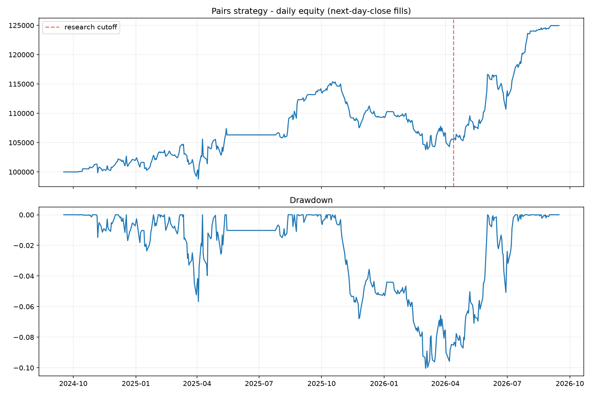

*Daily equity (top) and drawdown (bottom) with the research cutoff marked by the red dashed line (synthetic data).
**How to read it:** compare slope and drawdown depth on the left of the line (research period) with the right (genuinely
later data). A strategy that was over-fit shows a clear deterioration after the cutoff.*

### `evaluate_frozen_strategy_oos.py`
* **Question:** on data that played no part in choosing anything, does the frozen strategy hold up?
* **Frozen strategy:** 4 pairs, QCOM pairs excluded, entry at z = 3.0, directional zero-crossing exit, stop at |z| > 4.0,
  5 bps per leg turnover charged on entry and exit, fixed 7-sleeve allocation with only 4 deployed (≈42.86% of capital
  stays in cash).
* **Methodology (important):** the historical CSV may run later than the holdout start. All historical observations from the
  holdout start (2026-04-14) onward are **discarded**; they are never used for features, position reconstruction or P&L. The
  separate unseen CSV is appended only for causal continuation: rolling OLS at date *t* uses observations strictly before
  *t*. No pair selection or parameter tuning happens on the unseen data, and it deliberately does **not** use
  `backtest_summary.csv` because that file was produced with data reaching into the holdout.
* **Writes (with `--output-prefix`):** `_summary.csv`, `_selection.csv`, `_daily.csv`, `_equity.csv`, `_annual.csv`,
  `_monthly.csv`, `_pair_stats.csv`, `_pair_daily.csv`, `_trades.csv`, `_boundary_state.csv`, `_open_positions.csv`, and the
  two charts below.

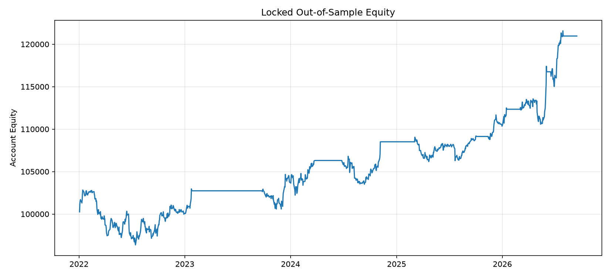


*Locked out-of-sample equity and drawdown (synthetic). **How to read them:** this is the one result that is not allowed to
be re-tuned. Judge it against the in-sample figure above and be suspicious if it looks far better; a decay is normal.*

### `plot_frozen_pair_spreads.py`
* **Question:** do the frozen pairs' hedged spreads actually look mean-reverting, and is the ±3σ entry band sensible?
* **How:** for each pair A/B fit `A = α + β·B + ε` on the last `--fit-days` (default 1250) overlapping observations up to
  `--cutoff` (default 2026-04-13), then plot `spread = A − β·B − α` with a rolling mean and ±σ bands
  (`--sigma`, default 3; `--rolling-window`, default 60 days; visualisation only).
* **Writes:** one PNG per pair (`<A>_<B>_hedge.png`), `all_hedged_spreads.png`, and a CSV per pair with the spread and rolling
  statistics.

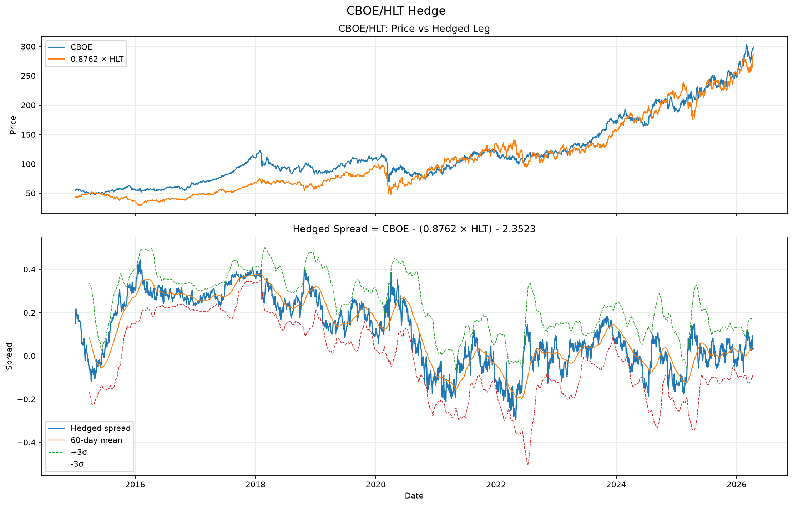

*One pair (synthetic): the price of A against β × B (top) and the hedged spread with its rolling mean and ±3σ bands
(bottom). **How to read it:** the two price lines should track each other, and the spread should oscillate around zero
and cross the mean often. A spread that wanders away and stays there is a broken pair. The combined image stacks all four pairs.*
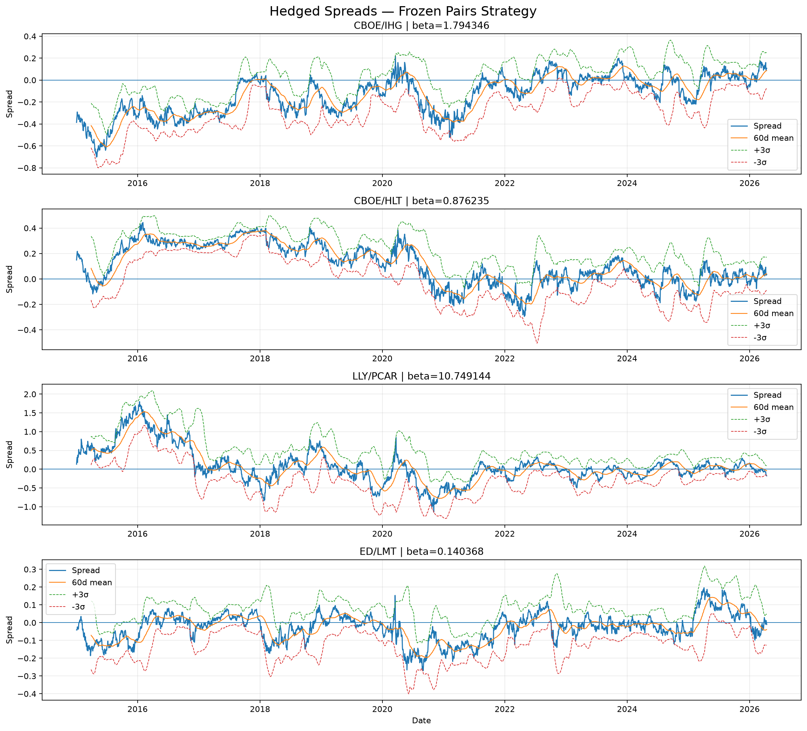 

---

## 9. Typical command sequences

**A. "Does an automatic selection process add value?" (stocks)**
```bash
python download_stock_prices.py                                   # edit START_DATE for full history
python explore_correlation_cointegration.py --csv raw_data.csv
python backtest_rolling_rescreen.py raw_data.csv --groups-csv groups.csv --candidates 50 --select 15 --outdir rolling_output
python baseline_random_selection.py rolling_output --sims 5000
python study_metric_predictiveness.py raw_data.csv --groups-csv groups.csv --screen-window 756 --holdout-start 2023-01-01
```

**B. Same on ETFs**
```bash
python download_etf_prices.py --start 2010-01-01
python backtest_rolling_rescreen.py etf_prices.csv --groups-csv groups_etf.csv --min-formation-trades 0 --min-edge-ratio 2 --candidates 50 --select 15
python study_metric_predictiveness.py etf_prices.csv --groups-csv groups_etf.csv --holdout-start 2023-01-01
```

**C. Strategy development and the locked test**
```bash
python pairs_backtest_engine.py --pair-selection fdr_bh --walk-forward --portfolio --top-n 10
python backtest_watchlist_walkforward.py --data-csv raw_data.csv
mkdir -p strat_test && python backtest_frozen_strategy.py --raw-data raw_data.csv
python plot_frozen_pair_spreads.py --raw-data raw_data.csv
python evaluate_frozen_strategy_oos.py --historical-csv raw_data.csv --unseen-csv raw_data_unseen.csv \
       --pairs CBOE/IHG,LLY/PCAR,CBOE/HLT,ED/LMT
```

**D. Older lineage (kept for reproducibility)**
```bash
python screen_pairs_train_test.py prices.csv -o pairs_results.csv --train-frac 0.6
python backtest_rolling_fixed_pool.py raw_data.csv pairs_results.csv --candidates 50 --select 15 --train-frac 0.6
python baseline_random_selection.py rolling_output --sims 5000
```

---

## 10. Old → new names

| Old | New |
|---|---|
| `data_fetch.py` | `download_stock_prices.py` |
| `download_etf_data.py` | `download_etf_prices.py` |
| `pair_plotter.py` | `explore_correlation_cointegration.py` |
| `coint_tester_v2.py` | `screen_pairs_train_test.py` |
| `coint_tester_backtester_rolling_new.py` | `backtest_rolling_fixed_pool.py` |
| `coint_tester_rescreen.py` | `backtest_rolling_rescreen.py` |
| `coint_tester_baseline_random.py` | `baseline_random_selection.py` |
| `panel_study.py` | `study_metric_predictiveness.py` |
| `pair_trader_v2.py` | `pairs_backtest_engine.py` |
| `comprehensive_backtest.py` | `backtest_watchlist_walkforward.py` |
| `final_final_strat.py` | `backtest_frozen_strategy.py` |
| `final_strategy_unseen_gpt.py` | `evaluate_frozen_strategy_oos.py` |
| `plot_hedge_spreads.py` | `plot_frozen_pair_spreads.py` |
| (new) | `pairs_common.py` |

The refactor moved code that was copy-pasted across three scripts into `pairs_common.py` without changing behaviour.
On test data the original and refactored versions produced byte-identical outputs.

---
